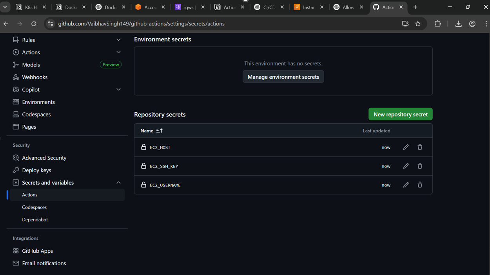
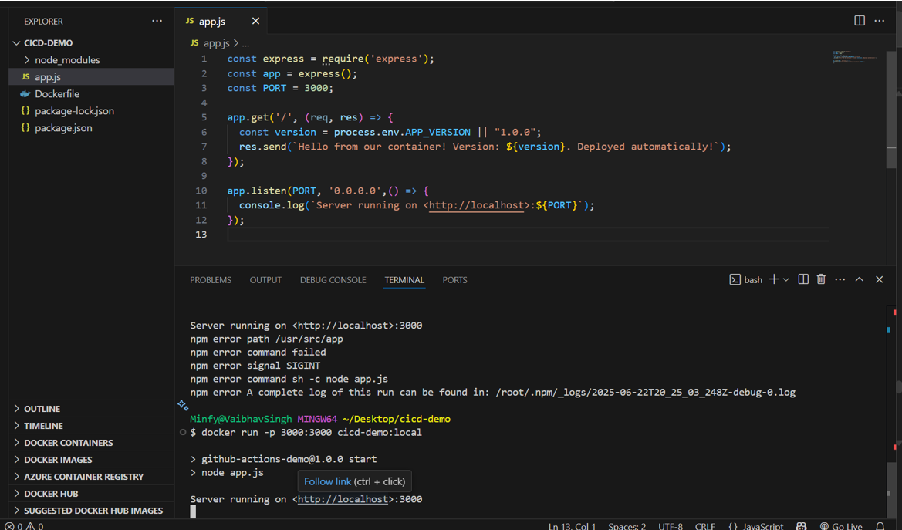
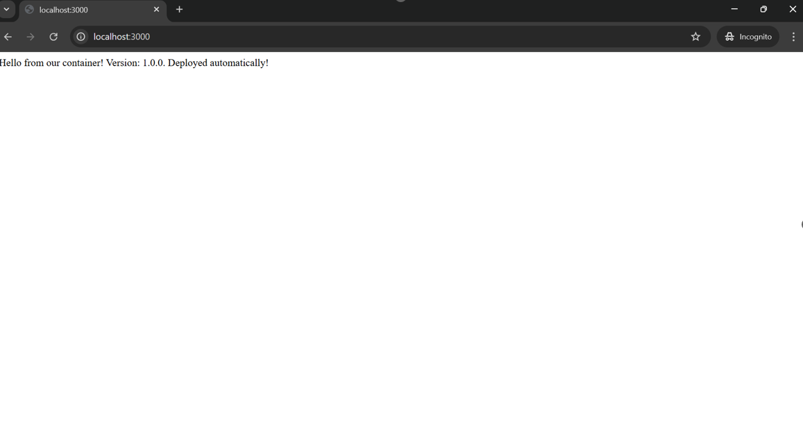
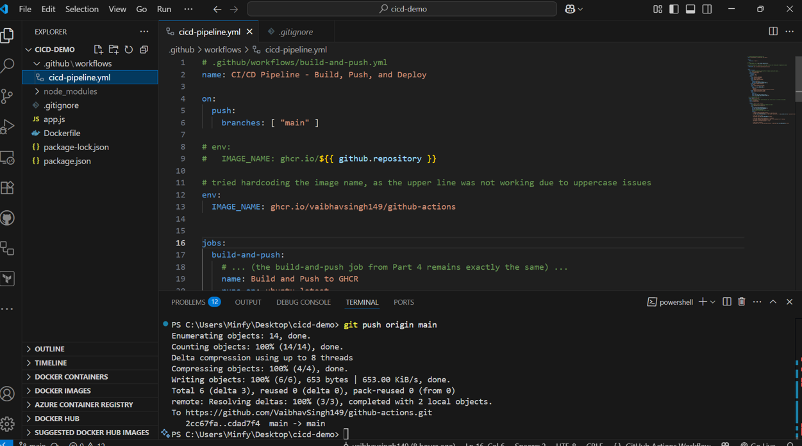
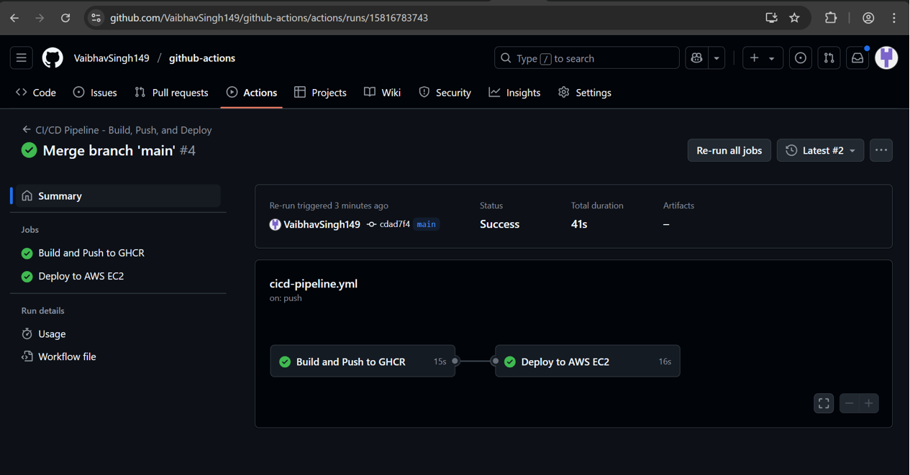
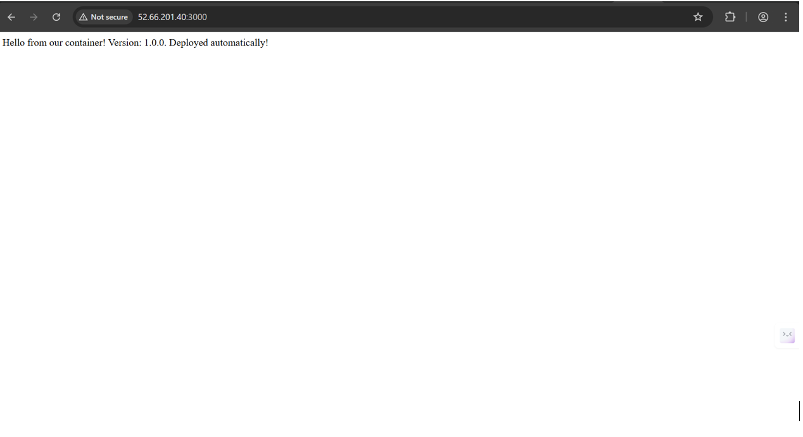

# 🚀 Containerized CI/CD Web App with GitHub Actions & AWS EC2

## 💡A simple Node.js web app that's containerized with Docker and deployed automatically to an AWS EC2 instance using a GitHub Actions CI/CD pipeline.

## 📑Overview
- Implements the containerization of a end to end devops automation. We containerized a simple node.js/express application, then created a CI/CD pipeline around it using github actions, and then deployed it on a EC2 instance

## 🧱 Stack Overview
- Node.js + Express: A lightweight HTTP server.

- Docker: Containerizing the application.

- GitHub Actions: Automates build and deployment.

- GitHub Container Registry (GHCR): Stores built Docker images.

- AWS EC2 Instance: Hosts the deployed container.

## 🚀What's happening (How it will work in a production based env)
- Developer commits code → triggers workflow

- GitHub Actions builds and pushes container image to GHCR

- Deploy job SSHs into EC2 → pulls image → replaces running container → launches fresh version

- App is live at http://<EC2_IP>:3000, showing the latest version tag (commit SHA)

Now that we know what's happening, let's begin with the project


## 🛠️ Getting Started
1. ### Let's start with cresting a directory for our project (working directory)
```bash
mkdir <proj_name>
cd <proj_name>
```
2. ### Install dependencies
```bash
npm init -y
npm install express
```
3. ### Aspects of the Application (Project structure)
```bash 
   📁<proj_name>
    - ├──app.js: Serves “Hello from our container! Version: ...”
    - ├──package.json: Defines dependencies and start script.
    - ├──Dockerfile: Builds the Docker image based on Node.js 18 and installs dependencies.
```

4. ### Publishing the code to github, to implement actions
- initialised a repo
```bash
    git init
    git add .
    git commit -m "Initial commit"
```
- Added a remote origin to this repo, so that I can push my local code to this remote repo
```bash
    git remote add origin https://github.com/<my-username>/<my-repo>.git
    git branch -M main
    git push -u origin main
```

## 📦 CI/CD Pipeline Workflow
- Let's start with creating a folder for our pipeline config, `.github/workflows/cicd-pipeline.yml`\

- My workflow had majorly two parts:

    - Build and Push: Build my Docker image and push it to GitHub’s Container Registry.

    - Deploy: Log into my AWS EC2 instance, pull the Docker image, and run it.

- The workflow is made in a way that it is triggered everytime something is pushed to the `main` branch


## ☁️ AWS EC2 Setup
- I'll use a Amazon Linux 2 EC2 instance (t2.micro preferably).

- Created and downloaded an SSH key-pair (.pem).

- Made adjustments to my Security Group to allow inbound:

    - Port 22 (SSH)

    - Port 3000 (App)

- Now that the instance is ready, SSH into the instance and install Docker:
```bash
    ssh -i path/to/key.pem ec2-user@<ec2-public-ip>
```


- Docker installation

```bash
    sudo yum update -y
    sudo yum install -y docker
    sudo systemctl start docker
    sudo systemctl enable docker
    sudo usermod -aG docker ec2-user
    exit
    # Then reconnected to use Docker as my user

```

## 🔐 GitHub Secrets (IMPORTANT❗)



- In Settings → Secrets & variables → Actions, add:

- EC2_HOST: Your EC2’s public IP

- EC2_USERNAME: Usually ec2-user

- EC2_SSH_KEY: Entire .pem content including headers

- GITHUB_TOKEN: Automatically available; used for GHCR authentication (a very optional step)

### Adding these will now allow github actions to access my instance for automated deployment


## ✅ Final Walkthrough (Documentation)
- ### Problems I faced, how I managed them

- Initially it was not listening to my request, so I had to add "0.0.0.0" to the app.listen to make sure my request was received.


- Now it was listening to my local host



- Next target was to make it available on my public ip, but then I had another error which was about my `github username not being valid` as it only takes lowercase letters, so I had to harcode my username into the code


- After when I committed this, the build was successful 


- Now the page was available on my public ip successfully
